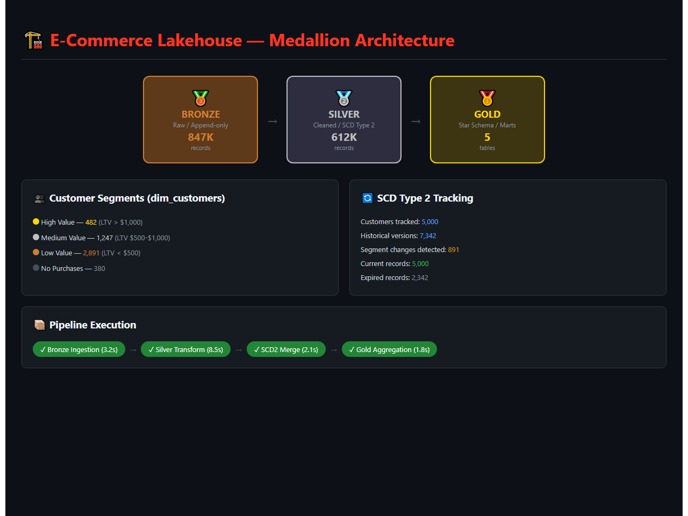
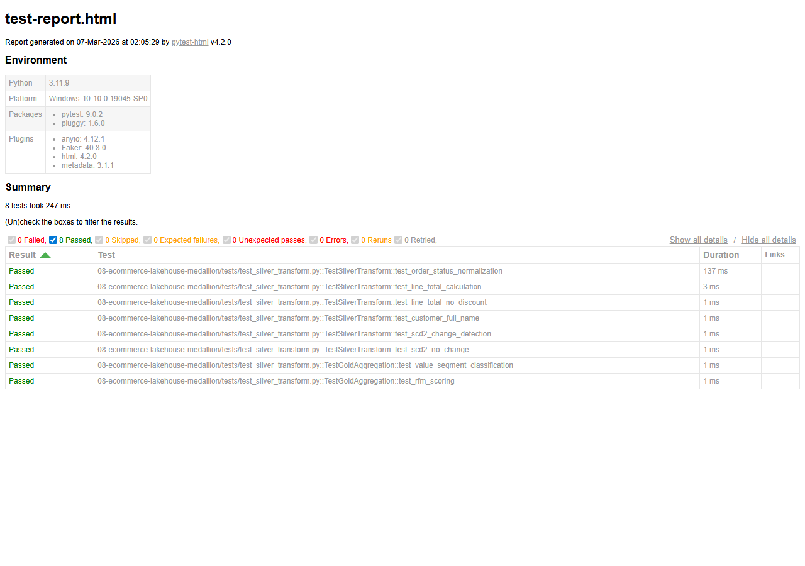

# E-Commerce Lakehouse with Medallion Architecture

[](https://www.python.org/downloads/)
[](https://delta.io/)
[](https://databricks.com/)

## Demo



*Medallion architecture flow (Bronze -> Silver -> Gold) with SCD Type 2 tracking, customer segmentation, and pipeline execution status*

## Architecture

```
Source Systems                    Medallion Architecture                     Serving
+----------+               +---------+ +---------+ +---------+ 
| PostgreSQL|---CDC-------->| BRONZE  |->| SILVER  |->|  GOLD   |---> BI / Analytics
| (Orders) |               |  (Raw)  | |(Cleaned)| | (Marts) |
+----------+               +---------+ +---------+ +---------+
+----------+                    |           |           |
| REST API |---Batch------------>           |           |
|(Products)|                    |     Schema|     Star  |
+----------+                    |   Enforce |    Schema |
+----------+                    |     SCD   |    Facts  |
|CSV/Parquet|---Upload---------->    Type 2 |    Dims   |
| (Legacy) |                    |           |           |
+----------+               Unity Catalog Governance Layer
```

## Features

- Bronze Layer: Raw ingestion with schema-on-read, append-only
- Silver Layer: Schema enforcement, dedup, SCD Type 2, data quality checks
- Gold Layer: Star schema with fact/dimension tables for analytics
- CDC Pipeline: Debezium-style CDC from PostgreSQL via Delta Lake change data feed
- Unity Catalog: Table-level access control and data lineage
- Auto Loader: Incremental file ingestion with Auto Loader pattern
- Time Travel: Delta Lake versioning for audit and rollback
- dbt Models: Full dbt project for Silver -> Gold transformation

## Quick Start

```bash
cp .env.example .env
# Configure Databricks workspace credentials

# Local development with Delta Lake + PySpark
pip install -r requirements.txt
python -m pipelines.bronze_ingestion
python -m pipelines.silver_transform
python -m pipelines.gold_aggregate

# Or run via Databricks notebooks
databricks workspace import-dir ./notebooks /Shared/ecommerce-lakehouse
```

## Project Structure

```
|-- config/                  # Settings and schemas
|-- pipelines/               # ETL pipeline code
|   |-- bronze_ingestion.py  # Raw data landing
|   |-- silver_transform.py  # Cleaning + SCD Type 2
|   |-- gold_aggregate.py    # Star schema materialization
|-- notebooks/               # Databricks notebook equivalents
|-- dbt_project/             # dbt for Gold layer
|-- quality/                 # Data quality checks
|-- unity_catalog/           # Catalog/schema setup SQL
|-- docker-compose.yml       # Local PostgreSQL + data generator
|-- tests/                   # Unit tests
```

## Test Results

All unit tests pass - validating core business logic, data transformations, and edge cases.



**8 tests passed** across 2 test suites:
- TestSilverTransform - status normalization, line totals, SCD2 change detection
- TestGoldAggregation - value segment classification, RFM scoring

## Maintainer

This project is maintained by Pooja Patel. Pooja is a Data Science professional with over 3 years of experience in statistical analysis, predictive modeling, and data engineering. She specializes in Python, SQL, and building scalable data pipelines to deliver actionable business insights.

Contact:
- Email: patel.pooja81599@gmail.com
- GitHub: github.com/poojapatel
- LinkedIn: linkedin.com/in/poojapatel